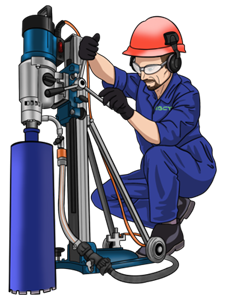

  English | <a href="https://github.com/sverlim/sverlim/blob/main/README.md">Українською</a>

<i>We build a system to fill everything, 
  so that there is no need for anything else.</i>

  

Everything we do, we do only for the advice of **`DIAMOND DRILLING ™`** service, a service for providing diamond drilling services in construction structures. Further in the text - **`SERVICE'**.

Each site, program, application, everything has a direct or indirect relationship with the service, carries both an open and hidden influence on the improvement of the service, or in some other way affects other tools of direct communication with the service.
We will try to attach an explanation to each project to understand what kind of idea was put into it, what was the algorithm of thoughts when the decision was made to start this or that direction. We are sure that many things will have all the signs of a separate independent type of activity, but believe everything only for the sake of service of a nationwide level.
      
> _Many repositories will be hidden because they will be in a not too acceptable view for display. But we will try as much as possible to convey information about their existence, purpose and content of that development, and of course we will make maximum efforts and make it look acceptable for display in order to open it as soon as possible._

   
<h2>DIAMOND DRILLING.</h2>

Android application for customers.   
Android app for artists.   
IOS application for customers.   

Software for implementing the possibility of interaction between service clients and service providers.

    
<h2>A search platform for professional assistants.</h2>

Service website, source code.   
Android application for assistants.   
IOS application for assistants.   

At certain periods of time during the year, the company experiences a shortage of employees. There were attempts to expand the company's staff to the limit of covering this deficit, but we faced the problem of providing such a number of employees with the volume of work. The main composition of the company's employees, who are directly engaged in the performance of services, is conditionally stable, everyone has a sufficient level of experience and knowledge to assume the duties of an operator. Based on this, we came to the conclusion that sometimes we need to attract a certain number of assistants to actually increase the number of links in the region.
In order to quickly and in sufficient numbers attract assistants, precisely according to the necessary search criteria, the only solution was to create a service, a site on which the questionnaires of employees who are satisfied with temporary employment will be posted. Thanks to the specialization of such a service, we see a solution to the seasonal shortage of personnel potential.

    

  

