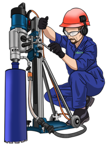

  Українською | <a href="https://github.com/sverlim/sverlim/blob/main/README.eng.md">English</a>

<i>Ми створюємо систему, щоб заповнити все, 
  щоб в іншому не було потреби.</i>

  

Все що ми робимо, ми робимо лише за ради сервісу **`АЛМАЗНЕ СВЕРДЛІННЯ ™`**, сервісу надання послуг алмазного буріння в будівельних конструкція. Надалі по тексту - **`СЕРВІС`**.

Кожен сайт, програма, додаток, все має пряме, або опосередковане відношення до сервісу, несе в собі як відкритий так і прихований вплив на покращення сервісу, або якимось іншим чином впливає на інші інструменти безпосереднього з’язку з сервісом.
До кожного проекту ми намагатимемось прикладати пояснення для розуміння того що саме за ідея в нього вкладувалась, який був алгоритм думок коли приймалось рішення про започаткування того чи іншого напрямку. Ми впевнені, що багато всього буде мати всі ознаки окремого незалежного виду діяльності, але повірте все лише заради сервісу загальнонаціонального рівня.
      
> _Багато репозиторіїв буде приховано, тому що знаходитимуться на не надто прийнятному вигляі для показу. Але ми будемо намагатися по можливосі донести інформацію про їх існування, призначення та зміст тієї розробки, та звичайно прикладатимемо максимум зусиль та приводитимемо у вигляд прийнятний для показу, аби чим швидше відкрити._

    
<h2>АЛМАЗНЕ СВЕРДЛІННЯ.</h2>

Програмне забезпечення для реалізації можливості взаємодії між клієнтами сервісу та виконавцями послуг.

Додаток Android для клієнтів. 

<h2>АЛМАЗНЕ СВЕРДЛІННЯ: Додаток Android для виконавців.</h2>

Додаток для реалізації можливості взаємодії між клієнтами сервісу та виконавцями послуг.    

<h2>АЛМАЗНЕ СВЕРДЛІННЯ: Додаток IOS для клієнтів.</h2>

Додаток для реалізації можливості взаємодії між клієнтами сервісу та виконавцями послуг.    

<h2>АЛМАЗНЕ СВЕРДЛІННЯ: Додаток IOS для виконавців.</h2>

Додаток для реалізації можливості взаємодії між клієнтами сервісу та виконавцями послуг.    

<h2>Платформа пошуку професійних помічників.</h2>

В певні періоди часу протягом року компанія відчуває дефіціт працівників. Були спроби розширення штату компанії до межі покриття цього дефіциту, але ми зіткнулися з проблемою забезпечення такої кількості працівників об’ємами робіт. Основний склад працівників компанії, що безпосередньо зайняті виконаням робіт з надання послуг є умовно стабільний, кожен має достатній рівень досвіду та знань для прийняття на себе обов’язків оператора. Виходячи з цього ми прийшли до висновку, що інколи нам потрібно залучення певної кількості помічників, для фактичного збільшення кількості ланок в регіоні.
Для того щоб оперативно і в достатній кількості залучати помічників, саме за потрібними критеріями пошуку, єдиним рішенням було створення сервісу, сайту на якому будуть розміщенні анкети працівників яких влаштовує тимчасова зайнятість. Завдяки спеціалізованості такого сервісу ми вбачаємо рішення сезонного дефіциту кадрового потенціалу.

