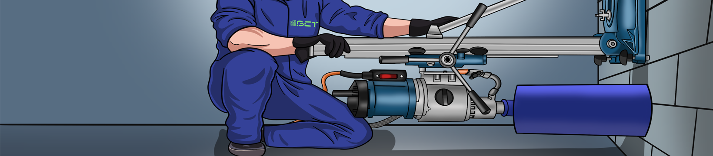

  

Все що ми робимо, ми робимо лише за ради сервісу «АЛМАЗНЕ СВЕРДЛІННЯ», сервісу надання послуг алмазного буріння в будівельних конструкція. Надалі по тексту - «СЕРВІС».
Кожен сайт, програма, додаток, все має пряме, або опосередковане відношення до сервісу, несе в собі як відкритий так і прихований вплив на покращення сервісу, або якимось іншим чином впливає на інші інструменти безпосереднього з’язку з сервісом. До кожного проекту ми намагатимемось прикладати пояснення для розуміння того що саме за ідея в нього вкладувалась, який був алгоритм думок коли приймалось рішення про започаткування того чи іншого напрямку. Ми впевнені, що багато всього буде мати всі ознаки окремого незалежного виду діяльності, але повірте все лише заради сервісу загальнонаціонального рівня.
      
    
    
<picture>
  

  Everything we do, we do only on behalf of the "АЛМАЗНЕ СВЕРДЛІННЯ™" service, a service for providing diamond drilling services in construction structures. Hereafter in the text - "SERVICE".
Each site, program, application, everything has a direct or indirect relationship with the service, carries both an open and hidden influence on the improvement of the service, or in some other way affects other tools of direct communication with the service.
We will try to attach an explanation to each project to understand what kind of idea was put into it, what was the algorithm of thoughts when the decision was made to start this or that direction. We are sure that many things will have all the signs of a separate independent type of activity, but believe everything only for the sake of service of a nationwide level.
  

  

  Все що ми робимо, ми робимо лише за ради сервісу «АЛМАЗНЕ СВЕРДЛІННЯ», сервісу надання послуг алмазного буріння в будівельних конструкція. Надалі по тексту - «СЕРВІС».
Кожен сайт, програма, додаток, все має пряме, або опосередковане відношення до сервісу, несе в собі як відкритий так і прихований вплив на покращення сервісу, або якимось іншим чином впливає на інші інструменти безпосереднього з’язку з сервісом. До кожного проекту ми намагатимемось прикладати пояснення для розуміння того що саме за ідея в нього вкладувалась, який був алгоритм думок коли приймалось рішення про започаткування того чи іншого напрямку. Ми впевнені, що багато всього буде мати всі ознаки окремого незалежного виду діяльності, але повірте все лише заради сервісу загальнонаціонального рівня.
  

</picture>
